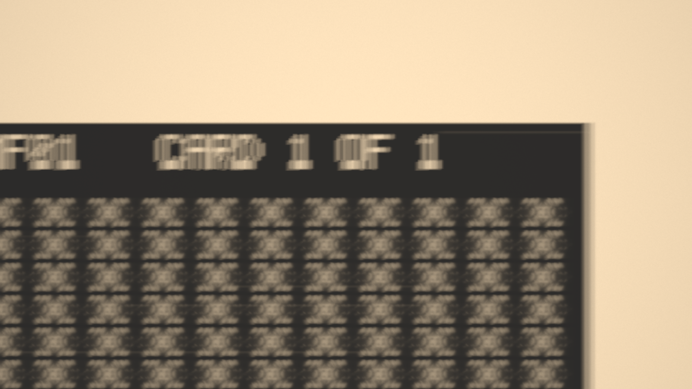
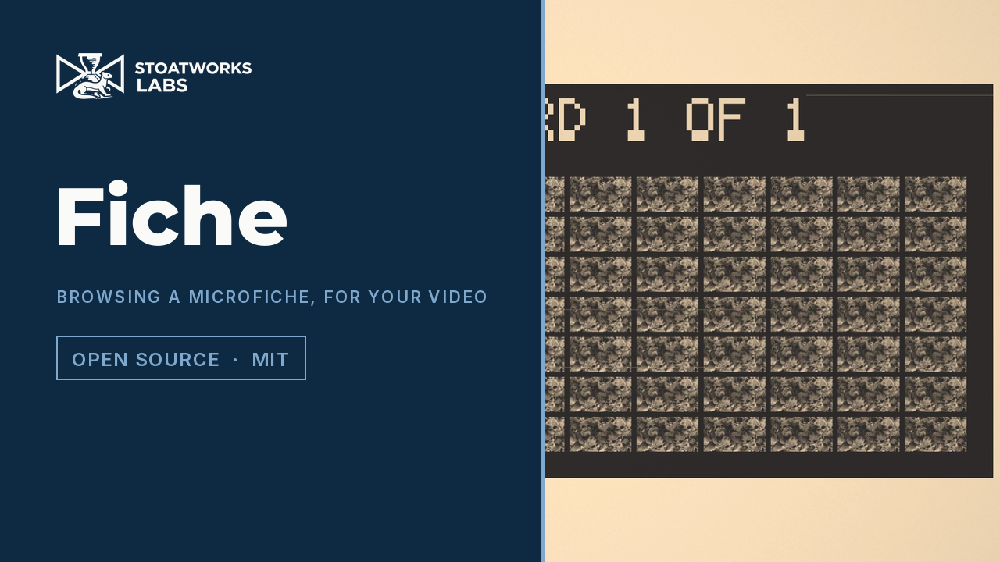

# fiche

> **AI-assisted project.** This codebase was created with [Claude](https://claude.com/claude-code)
> (Anthropic), directed and reviewed by a human author. The behaviour is not asserted
> but measured: an offline harness drives the real plugin class in a headless GL
> context and checks each claim — a point out of focus is a uniform disc of the radius
> geometric optics gives, to under 1%, and keeps its light; the card's bow, read back
> out of the picture, is the model's to 0.0003 mm; the picture is where the hand model
> puts the carriage through pans, corrections and crash zooms; the carriage on its grip
> is the second-order step response to 2e-11 mm against an independent integration;
> every pan's duration is Fitts's law and its profile minimum jerk; the hunt turns where
> a reaction time puts it and the picture's blur follows the knob frame by frame; a black
> clip stays black at 75× — with 23 negative controls and 11 one-character mutants that
> prove the checks can fail. It has **never been loaded into Resolume on macOS**.
> On Windows, a build of v0.1.0 loads, registers and renders in Resolume Arena 7.27.1 with all 39 host controls as declared, on software rendering. See [Status](#status).

Browsing a microfiche reader, as an FFGL effect for [Resolume](https://resolume.com)
Arena and Avenue.



<sub>One frame, rendered by `mftest`, the offline harness — not captured from
Resolume. Resolume's bundled `IntoTheGlow_02` on the defaults, thirteen and a half
seconds in: the operator has zoomed out to travel to another frame, and the card's
corner, its header and the glass of the carrier beyond it are going past, smeared
by the move and soft from a zoom that does not hold focus.</sub>

<!-- downloads:start -->

## Download

**[v0.1.0](https://github.com/stoatworks-labs/fiche/releases/tag/v0.1.0)** — prebuilt for macOS and Windows. Pick your platform:

<details>
<summary><b>macOS</b> — Universal (Apple Silicon + Intel)</summary>

| Build | Download | Size |
| --- | --- | --- |
| Universal (Apple Silicon + Intel) · .dmg disk image | [`fiche-0.1.0-macos-universal.dmg`](https://github.com/stoatworks-labs/fiche/releases/download/v0.1.0/fiche-0.1.0-macos-universal.dmg) | 274 KB |
| Universal (Apple Silicon + Intel) · .zip archive | [`fiche-macos-universal.zip`](https://github.com/stoatworks-labs/fiche/releases/latest/download/fiche-macos-universal.zip) | 230 KB |

</details>

<details>
<summary><b>Windows</b> — x64</summary>

| Build | Download | Size |
| --- | --- | --- |
| x64 · .exe installer | [`fiche-0.1.0-windows-x86_64-setup.exe`](https://github.com/stoatworks-labs/fiche/releases/download/v0.1.0/fiche-0.1.0-windows-x86_64-setup.exe) | 240 KB |
| x64 · .zip archive | [`fiche-windows-x86_64.zip`](https://github.com/stoatworks-labs/fiche/releases/latest/download/fiche-windows-x86_64.zip) | 134 KB |

</details>

All builds, checksums and release notes: [github.com/stoatworks-labs/fiche/releases](https://github.com/stoatworks-labs/fiche/releases).

macOS builds are signed and notarised and open normally. The Windows builds are unsigned, so SmartScreen warns once.

<!-- downloads:end -->

## The one idea

**A microfiche reader magnifies a hand.**

The screen shows about a centimetre of film at 24×, so every movement of the hand on
the carriage, every flick of the zoom and every turn of the focus knob arrives on the
screen multiplied by twenty-four. A hand's comfortable 50 mm a second is a metre a
second across the screen.

So the plugin is the hand and the reader:

- **the hand** makes aimed movements that obey Fitts's law, follow a minimum-jerk
  profile, land a little short with a scatter in proportion to how far they went, and
  are corrected when they miss; it zooms out to travel and back in to read; and it
  hunts for focus — turning the knob past sharp, noticing a reaction time later,
  turning back slower;
- **the carriage** is a mass on the hand's grip, so a fast pan stopped hard overshoots
  and settles, against end stops at the card's edges;
- **the reader** is a projection lens of magnification M and f-number N whose blur
  circle is geometric optics, a zoom that does not hold focus, a card that is not flat
  between its glass plates, a lamp, and a rear-projection screen with a hotspot and a
  grain of its own;
- **the film** is the clip printed in a grid of frames on silver, diazo or vesicular
  stock, with dust and scratches in its emulsion and a title in the header.

## What falls out

None of these is drawn. Each is the hand or the reader doing what it does:

- **Whip pans.** Magnification turns an ordinary hand movement into a smear across
  the screen — integrated over the exposure, so the faster the pan the longer the
  smear.
- **Overshoot and correction.** A long move lands short or long by a few percent of
  itself, which at 24× is a good part of a frame; the operator sees it and corrects
  with a second, smaller move. A carriage with play bounces when it stops.
- **Crash zooms.** To go far, the operator zooms out until the target is on screen,
  pans there — a wide view needs less precision, so the pan is quicker and rougher —
  and crashes back in. The zoom is not parfocal, so the wide view is soft, and the
  magnification it lands on is not quite the one it left.
- **The hunt.** On arrival the picture is soft — the card is bowed, so every frame
  is at a slightly different height. The knob goes past sharp, back, past again by
  less, and stops. A higher magnification has a shallower depth of focus and hunts
  longer; a poor operator starts the wrong way.
- **Soft corners.** The bow varies across the screen, so a picture sharp in the
  middle is never quite sharp at the edges.
- **The card itself.** Zoomed out: the grid of frames, the gutters, the header with
  its title, and beyond the card's edge only the reader's bright glass. Dust and
  scratches ride with the card; the screen's grain and its hotspot stay put.

With `Operator` on Manual the hand is yours: `Position X/Y`, `Zoom` and `Focus`, still
through the carriage's grip, the lens's blur and the screen.

[](https://www.youtube.com/watch?v=nHf3HR3aDns)

*[Watch it](https://www.youtube.com/watch?v=nHf3HR3aDns) — 65 seconds: the defaults' operator
skimming and searching a card at 24×, the zoom pulled right out to the whole card, searching with
every long move a crash zoom, a poor focuser hunting on a badly bowed card at f/2, a loose
carriage bouncing under a fast hand, diazo blue and vesicular film, the step-and-repeat camera
filling a blank card in reading order, and a close-up at 40× with dust and scratches under a warm
lamp. Every frame is the real plugin's output: an FFGL plugin has no window, so the footage is
rendered by this repository's own offline harness (`mftest --pipe`, driven by a cue sheet) rather
than filmed off a screen, and the clips are Resolume's bundled demo media.*

## Controls

| Group | |
| --- | --- |
| **Operator** | Operator (Auto, Manual), Browse (Reading, Skimming, Searching, Mixed), Dwell (0.1–10 s between acts), Sync (Free, Beat, 2 Beats, Bar — acts start on the host's beat), Hand Speed (Fitts's slope, 0.25 to 0.03 s/bit), Accuracy (the landing scatter, 25% to 1% of the distance), Crash Zoom (how often a long move zooms out to travel), Focus Skill (reaction time, how much each pass slows, the first turn's direction), Carriage Play (rigid, or a grip from 40 Hz down to 3 Hz), Jump (end the dwell now). |
| **View** | Zoom (2×–75×; in Auto, the magnification the operator reads at), Position X, Position Y, Focus (Manual: the hand, and the defocus at the screen's centre, ±1 mm). |
| **Fiche** | Columns, Rows (1–16 each), Gutter (0–3 mm), Content (Live: every frame the clip as it plays; Filmed: a step-and-repeat camera films the clip into the frames, one per Interval), Interval (0.05–10 s), Film (Ideal, Silver, Silver Negative, Diazo Blue, Diazo Black, Vesicular, Colour), Flatness (the card's bow, 0–0.5 mm), Dust, Scratches, Title (the header's text). |
| **Reader** | Aperture (f/2–f/16), Parfocal (how far the zoom throws the focus, 0–1 mm per doubling), Shutter (the exposure, as a share of the frame), Hotspot (the projection's cos⁴ falloff), Lamp (2000–6504 K), Screen Grain, Room Light. |
| **Output** | Seed, Mix. |

The defaults are somebody in a library reading room going through a card in a hurry:
a 14 × 7 card of the clip on silver film, read at 24× through an f/2.8 lens whose
zoom does not hold focus, the card bowed 0.3 mm between plates that no longer close,
a carriage with some give in it, and an operator who skims and searches, zooms out
to travel more often than not, and is not good at focusing.

## Status

**v0.1.0, and honestly early — 8 October 2026.**

### Measured offline, on macOS

`tools/verify.sh` passes on this machine (Apple Silicon, macOS 26) against a fresh
universal Release build, running every check at **two rasters**, 1280×720 and 320×180,
and again on **Apple's software renderer** at 320×180. What it establishes:

| check | result |
| --- | --- |
| `--identity` | Manual, one frame filling the screen, an Ideal film under a white lamp: worst \|out − clip\| **0.000314** (bound one half-float ULP, 0.000489), **0 of 2,764,800 bytes** differ at 720p |
| `--mips` | every texel of the clip's mip chain is the area average of its share of the level below, to **0.000487** (a half-float ULP), 10 levels at 720p |
| `--dark` | a black clip on clear film is **exactly 0** on every card pixel at 4×, 24× and 75× |
| `--magnify` | every frame and card edge lands where M × card mm × pixels per mm puts it, about the screen's centre, to **0.0001 px** at 3×, 6× and 11× |
| `--defocus` | a point δ out of focus is a disc of radius M²\|δ\| / (2N(M + 1)) on the screen, by its second moment, within **0.77%** at worst across 8 cases (12×–60×, f/2–f/2.8, ±0.4–1 mm, both rasters; bound 1%); it carries **0.996–1.0002** of the point's light |
| `--field` | on a bowed card, 18 points each come sharpest where the model's bow puts them: within **0.0003 mm** at 720p (bound 0.005), 0.0086 mm at 320 px (bound 0.03) |
| `--track` | 600 frames of an Auto operator (pans, corrections, crash zooms, the carriage up to 560 mm/s): the screen's centre, read off a coordinate clip, is the model's carriage to **0.018 mm** of card in every one of 587 frames (bound a half-float ULP per store and one for the filter), and not the hand, which the grip lags by up to 7 mm |
| `--carriage` | a hand step through a 3 Hz, ζ 0.2 grip: the model's carriage within **1.7e-11 mm** of an independent RK4 integration; overshoot **0.5245**, the textbook exp(−πζ/√(1−ζ²)) × the one-frame spread **0.5245**; the picture within 0.011 mm |
| `--shutter` | a constant-speed carriage smears an edge centred **exactly** on its mid-exposure position (0.000 px) and as long as the exposure's travel (24.03 px for 24, 48.00 for 48) |
| `--hunt` | reversals at δa + vτ past focus **exactly**, each pass **0.413** of the last's speed (the gain), stopped inside δa; the picture's blur against the knob's over 71 frames: worst **0.97%** (bound 2%) |
| `--stock` | all seven films' prints within **0.0005** of T = dense + (base − dense) f across a ramp; gutters at the unexposed density; the glass clear |
| `--screen` | the falloff within **5.5e-7** of cos⁴; the grain **identical** at two carriage positions; the dust the same picture 17 px over after the card moved 17 px, to 0.0008 |
| `--filmed` | after 20 and 70 frames at a 0.0731 s interval, **12 of 12** frames hold the clip frame the camera exposed into them, in reading order |
| `--sync` | at 117 BPM, 17 acts each starting within **5e-8 s** of a beat |
| `--fitts` | 1,590 pans over 900 s: durations a + b log2(D/W + 1) exactly; peak speed within **0.19%** of minimum jerk's 1.875 D/T; landing scatter **0.067 D** along (k 0.07) and **0.028 D** across (0.4 k), the same for short and long pans; **1,589 of 1,589** followed by a correction exactly when they missed |
| `--operator-law` | 1,500 s in each Browse mode: the carriage on the card and the lens in range throughout; Reading **1,910 of 1,910** steps to the next view; Searching's jumps uniform (chi-square 38.5 on 46 degrees of freedom); a seed browses identically twice |
| `--resize`, `--state` | a new raster is a fresh card (**0 bytes** differ); the host's GL state comes back |
| `--negative` | **23** deliberately wrong models, **23** caught |
| mutation | **11** one-character mutants of the shipped GLSL and C++, **11** caught |
| `tools/sweep.py` | all **33** controls measurably change the picture |
| shaders | all 6 compile through `glslc`, not merely through Apple's driver |
| the bundle | universal (`x86_64 arm64`), exports `plugMain`, ad-hoc signs; `oxbow` reports `SW Fiche` / `MF01` / `effect` and renders 120 frames through `plugMain` |

Render cost, GPU time by `GL_TIME_ELAPSED`, median of 120 frames after a warm-up, on a
GPU shared with other work:
at the defaults, with the operator browsing, **1.27 ms** at 720p, **2.40 ms** at 1080p and
**9.09 ms** at 4K; with every pixel taking all 32 taps (a millimetre out of focus and
panning), **1.46**, **2.75** and **10.05 ms**; filming a frame every 0.05 s, **1.35**,
**2.59** and **9.65 ms**. At 4K that is more than half of a 60 fps frame: the taps
scale with the pixels, and nothing yet trades taps for resolution.
macOS figures only.

### Not established

It has **never been loaded into Resolume on macOS**. Everything above was compiled,
rendered and measured offline against the real plugin class in a headless CGL
context, plus an `oxbow` load. How 33 controls read in Arena's inspector, and how
the operator feels to somebody who has sat at a real reader, are untested.

**Windows, in Resolume Arena 7.27.1** (win-lab, Mesa llvmpipe, no GPU, 2026-10-09): a
build of this source loads from Extra Effects, registers as `SW Fiche` / `MF01` /
effect, all 39 host controls match the declaration in name, order, type, range and
default, it renders, and Arena's log stays clean: 9 of 9 of the fleet gate's checks.
26 of the 32 controls it can move changed the picture (31 under a precondition) and
none read dead; the six that steer the operator over seconds — Hand Speed, Accuracy,
Crash Zoom, Focus Skill, Carriage Play and Parfocal — were inconclusive, because the
gate compares single grabs and the Auto operator moves the picture between them;
`tools/sweep.py` proves all six on a fixed seed. Software rendering says nothing about
a GPU or about speed.

The laws the hand follows are the motor-control literature's (Fitts; Flash and Hogan;
Harris and Wolpert; Elliott, Helsen and Chua), but the constants are typical, not one
person's, and the hunt is a model of a person, not a measurement of one. The film
stocks' densities and dyes are typical, not a datasheet's. A real reader's zoom covers
about 2:1; this lens's 2×–75× is a deliberate stretch so a crash zoom can reach the
whole card. There is a [user guide](docs/USER-GUIDE.md); no OpenFX port and no
browser demo.

## Build

Needs CMake 3.15+, a C++17 compiler, and the FFGL SDK submodule.

```bash
git clone --recursive https://github.com/stoatworks-labs/fiche
cd fiche
cmake -B build -DCMAKE_BUILD_TYPE=Release
cmake --build build --parallel
cmake --install build     # into ~/Documents/Resolume Arena/Extra Effects
```

macOS builds are universal (Apple Silicon + Intel) by default; add
`-DCMAKE_OSX_ARCHITECTURES=arm64` for a faster dev build. Windows needs GLEW via vcpkg.

## Building and testing

The offline harness renders the real plugin class headlessly, on a synthetic 60 fps
clock:

```bash
./build/mftest --out /tmp/fiche.png --size 1920x1080 --frames 120   # the test card
./build/mftest --list                                             # every control, kind and default
./build/mftest --trace --frames 600                               # what the hand does, frame by frame
./build/mftest --defocus --field --track --hunt                   # each claim, measured
./build/mftest --negative                                         # and the checks can fail
./build/mftest --bench                                            # 720p through 4K
python3 tools/sweep.py                                            # no control is silently dead
tools/verify.sh                                                   # all of it, on a fresh universal build
```

Every check takes `--size`; run it at 320×180 as well as the raster you care about.
Footage goes through the real shaders with `--pipe`, in the fleet's frame format:

```bash
ffmpeg -i in.mov -vf fps=60 -f rawvideo -pix_fmt rgba -s 1920x1080 - \
  | ./build/mftest --pipe --size 1920x1080 --script cues.txt \
  | ffmpeg -f rawvideo -pix_fmt rgba -s 1920x1080 -r 60 -i - out.mp4
```

See [`CLAUDE.md`](CLAUDE.md) for the full command reference and
[`AGENTS.md`](AGENTS.md) for the model and the traps.

## Browser demo

**<https://fiche-demo.stoatworks-labs.com/>** runs the plugin itself, not a port of it:
`source/Fiche.cpp` and everything it calls — the hand, the reader, the title font, the
parameter table — with the FFGL SDK classes it uses, compiled unmodified to WebAssembly
by `demo/tools/build-wasm.sh` (emscripten) and drawing with its own GLSL in WebGL2. The
panel is read back from the plugin's own declarations. The page is the host: it sends
no beat (Sync keeps the plugin's own 120 BPM), its clock is the browser's, the clip is
generated in the page, and six GL entry points are translated for WebGL2
(`demo/wasm/gl_shim.cpp`). Compared once with `mftest --pipe` on the same frames, in
Manual, over ten seconds of the Auto operator and on the filmed card, it agreed to one
level in all but one pixel. `tools/verify.sh` fails if `demo/shaders.js` or any input of
the `.wasm` has drifted from `source/`. It is a demo, not the plugin; the page lists
everything it does not reproduce.

<!-- attributions:start -->
This project is built on other people's work — see [ATTRIBUTIONS.md](ATTRIBUTIONS.md).
<!-- attributions:end -->

## Licence

MIT — see [LICENSE](LICENSE).
